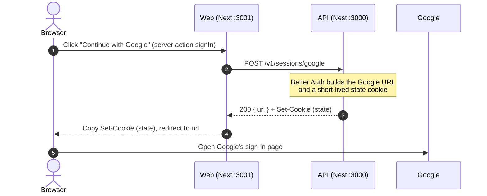
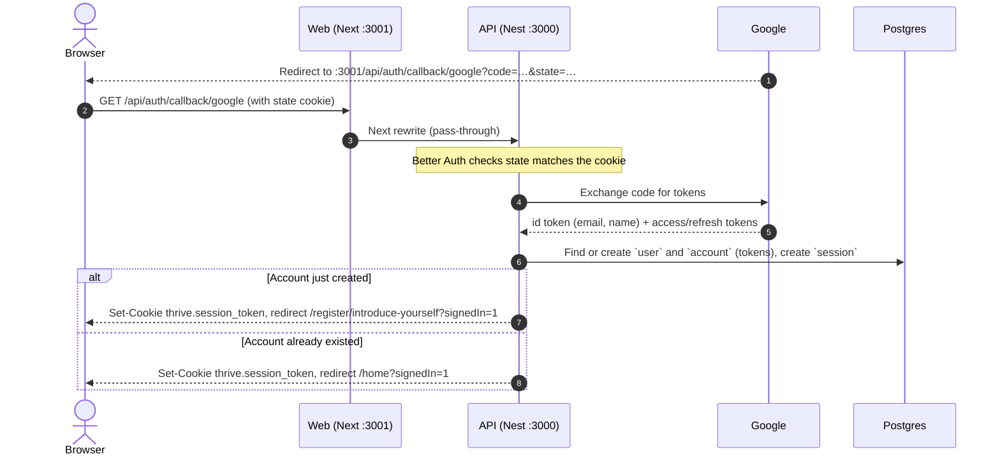
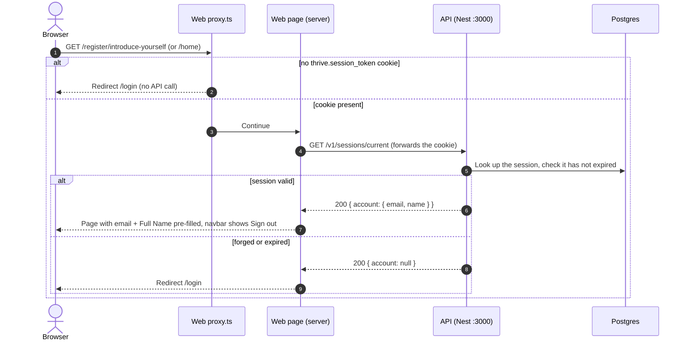
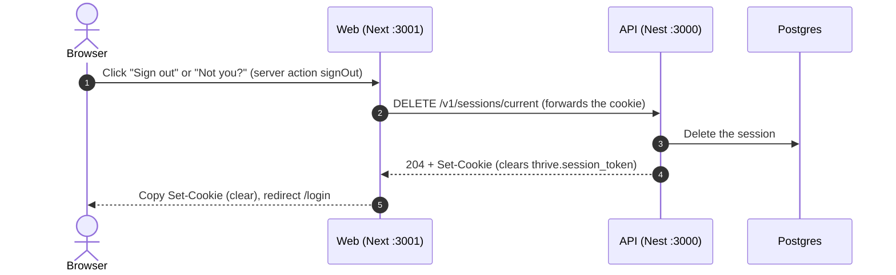

# #70 — Google sign-in flow

Status: planned · 2026-10-02
Plan: [`0070-google-sign-in.md`](0070-google-sign-in.md)

The browser only ever talks to the web app (`:3001`). The web server calls the API (`:3000`)
through the generated client. Google talks to the browser, and to the API when it exchanges the
code.

## Endpoints

| Endpoint | Owner | Used for | Returns |
| --- | --- | --- | --- |
| `POST /v1/sessions/google` | ours | Start Google sign-in | `200 { url }` + state cookie |
| `GET /v1/sessions/current` | ours | Who is signed in | `200 { account: { email, name } \| null }` |
| `DELETE /v1/sessions/current` | ours | End the session | `204` + cookie-clearing `Set-Cookie` |
| `GET /api/auth/callback/google` | Better Auth | Google's redirect back | session cookie + redirect to `/home` or `/register/introduce-yourself` |

## 1. Start sign-in



### What happens inside step 3

This is the standard **OAuth 2.0 Authorization Code flow** ([RFC 6749]) with **PKCE**
([RFC 7636]), which Google uses for its OpenID Connect sign-in. Better Auth 1.7 does the
following (read from `better-auth/dist/state.mjs`; it uses database state storage because we
have a database):

1. It makes a random 32-character `state` and a random PKCE `code_verifier`.
2. It saves one row in the `verification` table with the identifier `auth-state:<state>`,
   expiring in 10 minutes. The row holds:
   - where to land afterwards: `callbackURL` (`/`), `newUserURL` (`/register/introduce-yourself`)
     and `errorURL` (`/login`);
   - the `code_verifier`.
3. It sets the **state cookie** `thrive.state`, signed with `BETTER_AUTH_SECRET`, holding the same
   `state` and lasting 5 minutes.
4. It builds Google's URL and returns it as `{ url }`. The URL looks like this:

   ```
   https://accounts.google.com/o/oauth2/v2/auth
     ?client_id=<GOOGLE_CLIENT_ID>
     &redirect_uri=http://localhost:3001/api/auth/callback/google
     &response_type=code
     &scope=openid email profile
     &state=<state>
     &code_challenge=<SHA-256 of code_verifier>&code_challenge_method=S256
     &prompt=select_account
   ```

**What the state does.** It proves that the callback in flow 2 belongs to a sign-in *this
browser* started. On the callback, Better Auth checks three things:

- the `state` Google sends back has a matching `verification` row;
- that row hasn't expired;
- the signed `thrive.state` cookie holds the same value.

If someone tricks a person into opening a callback link made with an attacker's own Google code
(login CSRF, [RFC 6749 §10.12]), the browser has no matching cookie, so the sign-in is refused.

**What PKCE does.** Only the hash of the `code_verifier` goes to Google. When Better Auth exchanges
the code in flow 2, it sends the verifier itself, so a stolen `code` alone is useless.

**How the web knows where to go.** It doesn't build the URL. It takes `url` from the API's
response, and the server action's `redirect(url)` answers the browser with a `303 See Other` to
Google. The browser just follows the redirect.

[RFC 6749]: https://datatracker.ietf.org/doc/html/rfc6749
[RFC 6749 §10.12]: https://datatracker.ietf.org/doc/html/rfc6749#section-10.12
[RFC 7636]: https://datatracker.ietf.org/doc/html/rfc7636

## Better Auth's role across the flows

| Flow | Better Auth does | Thrive's code does |
| --- | --- | --- |
| 1. Start | Makes the state and PKCE, stores them, signs the state cookie, builds Google's URL | The endpoint, copying the cookie, the redirect |
| 2. Callback | Checks the state, exchanges the code with Google, verifies the id token, creates or finds `user` and `account`, stores Google's tokens, creates `session`, sets the session cookie, picks new-user or returning redirect | Only the rewrite that forwards the request |
| 3. Page | Checks the session cookie's signature and the `session` row's expiry | `GET /v1/sessions/current` and mapping it to `{ email, name }`, `proxy.ts`, the redirects |
| 4. Sign out | Deletes the `session` row, writes the clearing cookie | The endpoint, copying the cookie, the redirect |

In OAuth terms, Better Auth is the **client** (OpenID Connect calls it the *relying party*): the
app Google signs people into. It is also Thrive's **session store**. It doesn't own anything
about Workspaces or Members (ADR 0025).

## 2. Google callback



### What the Next rewrite is

A **rewrite** is a proxy inside the Next server, configured in `next.config.js`:

```
/api/auth/callback/:path*  →  ${API_BASE_URL}/api/auth/callback/:path*
```

When the browser asks `localhost:3001/api/auth/callback/google?…`:

- the Next server sends the same request (method, path, query, headers, **including `Cookie`**) to
  `localhost:3000`;
- it streams the API's answer back unchanged: status, `Location` and **`Set-Cookie`**.

It is not a redirect. The browser never sees `:3000`, and its address bar stays on `:3001`. That is
why Google's `redirect_uri` can be the web origin, and why the cookies are set on the web origin.
On real domains the web and API hosts differ, and a cookie set by the API's host would never reach
the web's pages.

Only `/api/auth/callback/*` is rewritten. Every other API call goes through the generated client
from the web server.

### What `GET /api/auth/callback/google` does, step by step

This is Better Auth's own route (`better-auth/dist/api/routes/callback.mjs`). The numbers match the
diagram.

1. **Google sends the browser back.** After the person picks an account and agrees, Google
   redirects to the `redirect_uri` from flow 1, adding `?code=…&state=…`. If they cancel, Google
   sends `?error=access_denied` instead.
2. **The browser opens the callback** on `:3001`. Because it's the same site, it sends the
   `thrive.state` cookie from flow 1.
3. **The rewrite forwards it** to the API, cookie included (see above).
4. **Better Auth checks the state** (`parseState`):
   - the `state` in the URL must have a `verification` row `auth-state:<state>` that hasn't expired
     (10 minutes);
   - the signed `thrive.state` cookie must hold the same value.

   It then **deletes the row and expires the cookie**, so a state works only once. From the row
   it recovers `callbackURL`, `newUserURL`, `errorURL` and the PKCE `code_verifier`. Any mismatch
   or expiry redirects to `errorURL` (`/login?error=…`). So does an `error` from Google, such as
   the person cancelling.
5. **Better Auth exchanges the code** (server to server, the browser isn't involved). It POSTs to
   Google's token endpoint with:
   - the `code`;
   - `GOOGLE_CLIENT_ID` and `GOOGLE_CLIENT_SECRET`;
   - the same `redirect_uri`;
   - the `code_verifier` (PKCE).

   Google checks the verifier against the `code_challenge` it saw in flow 1. A bad or reused code
   redirects to `/login?error=invalid_code`.
6. **Google returns tokens**: an `id_token` (a signed JWT saying who the person is: email,
   `email_verified`, name, picture, and `sub`, Google's permanent id for them), an `access_token`,
   and possibly a `refresh_token`. Better Auth checks the `id_token` and reads the profile from it.
   No email means it redirects to `/login?error=email_not_found`.
7. **Better Auth finds or creates the person** (`handleOAuthUserInfo`):
   - **Returning:** an `account` row with `providerId = google` and `accountId = sub` exists. It
     updates that row's tokens and uses its `user`. Result: `isRegister = false`.
   - **Same email, no Google link yet:** a `user` with this email exists, for example from another
     sign-in method later on. Better Auth links a new `account` row to it if Google is a trusted
     provider or Google says the email is verified. That's still `isRegister = false`.
   - **New:** it creates a `user` row (UUIDv7 id, email, name, image), an `account` row
     (`providerId = google`, `accountId = sub`, the tokens, the scopes) and sets
     `isRegister = true`.

   It then creates a `session` row: a random token, an expiry (Better Auth's default is 7 days),
   and the IP and user agent.
8. **Better Auth answers with a redirect** and sets **`thrive.session_token`**: the session token
   plus a signature made with `BETTER_AUTH_SECRET`, `HttpOnly` (page scripts can't read it),
   `SameSite=Lax`, and `Secure` on https. On https the name also gains a `__Secure-` prefix,
   so `proxy.ts` checks both names.
   - If `isRegister` is true, it redirects to `newUserURL`, `/register/introduce-yourself`.
   - Otherwise it redirects to `callbackURL`, `/`.

   The response travels back through the rewrite unchanged, so the browser stores the cookie on
   `:3001` and follows the redirect into flow 3.

### Toasts after the callback

- **`?signedIn=1`:** the page Google returns to raises a success toast, *Signed in as
  &lt;email&gt;*, then drops the query, so a refresh shows nothing. Better Auth adds the query
  because the API passes it in `callbackURL` and `newUserCallbackURL`.
- **`?error=…`:** a failed attempt lands on `/login` with an error toast, *Sign-in didn't finish.
  Try again.*

Both use `OneTimeToast` in `app/(public)/_components/`.

## 3. Opening a signed-in page



`/login` does the same check the other way round: a valid session redirects to `/home`. `/` itself is public: it becomes the landing page.

## 4. Sign out



## Why it is shaped this way

- **One origin for the browser.** The session cookie belongs to the web app, so there's no CORS
  and no third-party cookie. The rewrite only carries Google's redirect in flow 2.
- **Cookie hand-off.** In flows 1 and 4 the API answers the web *server*, not the browser, so the
  server copies the API's `Set-Cookie` onto its own response (`set-cookie.util.ts`).
- **New or returning is decided once, in flow 2.** Better Auth knows whether it just created the
  Account.
- **Two checks in flow 3.** The proxy is fast and only sees that a cookie exists. The page's
  `GET /v1/sessions/current` is the check that counts.
- **Google's tokens stay in the API**, in the `account` table, ready for the Calendar work in Epic #12.
